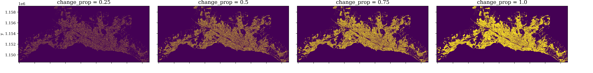
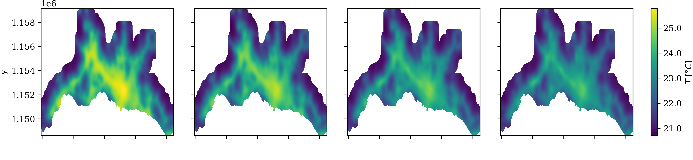
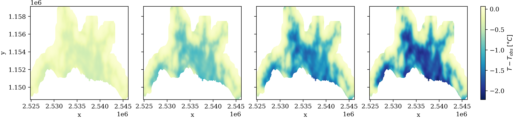

# Lausanne greening scenarios

Spatially-explicit simulation of urban heat mitigation by increasing the tree canopy cover in Lausanne

## Notebooks

* [Scenario evaluation](https://github.com/martibosch/lausanne-greening-scenarios/blob/master/notebooks/scenarios.ipynb)
* [Scenario metrics](https://github.com/martibosch/lausanne-greening-scenarios/blob/master/notebooks/scenario-metrics.ipynb)
* [Human exposure](https://github.com/martibosch/lausanne-greening-scenarios/blob/master/notebooks/human-exposure.ipynb)

## See also

* [Lausanne heat islands](https://github.com/martibosch/lausanne-heat-islands)
* [Lausanne agglomeration extent](https://github.com/martibosch/lausanne-agglom-extent)
* [Lausanne tree canopy](https://github.com/martibosch/lausanne-tree-canopy)
* [InVEST urban cooling model calibration](https://github.com/martibosch/invest-ucm-calibration)
* [Swiss urban heat islands utils](https://github.com/martibosch/swiss-uhi-utils)

## Acknowledgments

* With the support of the École Polytechnique Fédérale de Lausanne (EPFL)
* Project based on the [cookiecutter data science project template](https://drivendata.github.io/cookiecutter-data-science). #cookiecutterdatascience
